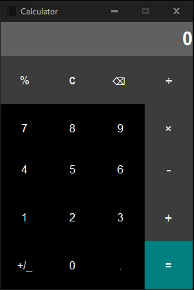

# Calculator_Qt

## Description
Simple calculator made with C++ and Qt.

## Functions 
* Addition, Subtraction, Multiplication, Division,
* Sign change, Percentage,
* Clear, Backspace

## Requirements 
* Qt creator ([download](https://www.qt.io/download))

## Get it running
1. Set up Qt
2. Clone this repository `git clone https://github.com/Topesa/Calculator_QT.git`
3. Open project with Qt creator
4. Inside Qt creator click on `Configure Project`

## Screenshot

